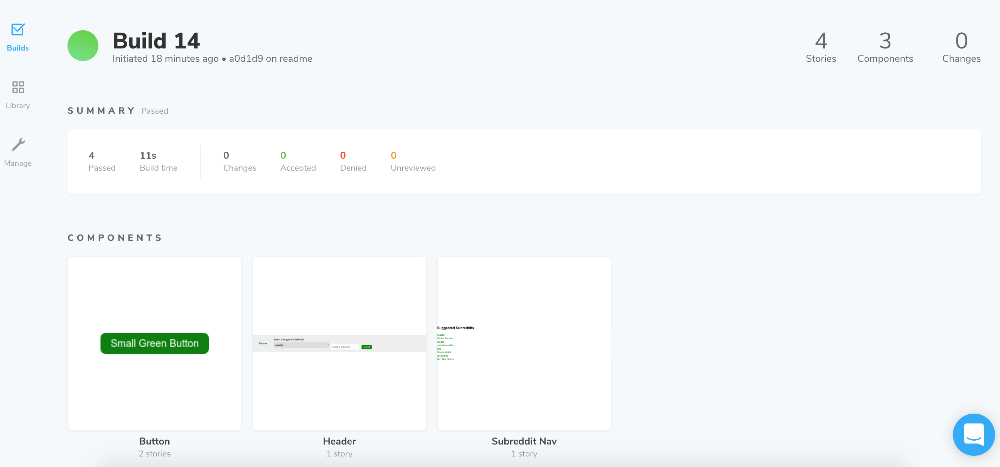

# Trov Subreddit Application

## Installation
To run this application locally, clone this repo, `cd` into it and run either `yarn install` or `npm install`. Please note that I used yarn to build this and npm will create a package-lock file and warn you about it.

To run the application locally, run either `yarn start` or `npm run start` which will start up an instance of [`webpack-dev-server`](https://github.com/webpack/webpack-dev-server).

To create an optimized production build run either `yarn build:prod` or `npm run build:prod`. This will create a static build in the `/build` directory, which is ignored by `git` on purpose. A live example of a prod build [can be viewed here](https://trov-subreddit.netlify.com/).

Many other useful/interesting scripts can be seen in the `scripts` section of the [`package.json`](package.json#L5) file. An example would be `yarn build:stage` which will use environment variables from [`.env.staging`](.env.staging) for use in the build. Although I am not using it in this example, this is part of my starter kit and very useful for testing the application against different API versions.

## Technology used

### React
I started this project based on my own personal react starter kit, which itself is based off of [`create-react-app`](https://github.com/facebook/create-react-app). I use this approach primarily to handle the burden of managing build processes and configurations which it accomplishes by abstracting a lot of the heavy lifting into a package called [`react-scripts`](https://www.npmjs.com/package/react-scripts).

I structured the project in the fashion I have seen in many other projects with the majority of the important files in [`/src/containers`](/src/containers) and  [`/src/components`](/src/components). I use [Stateless Functional Components](https://reactjs.org/docs/components-and-props.html) wherever possible and really only had to use a stateful class-based container for the main subreddit container, [`/src/containers/subreddit-container.jsx`](/src/containers/subreddit-container.jsx), in order to take advantage of React's [lifecycle events](https://reactjs.org/docs/state-and-lifecycle.html).

### Redux
Although I actually found that I didn't really need to use it, I imcorporated a redux store for global state management as per the instructions for this test. If you have the [Redux DevTools](https://chrome.google.com/webstore/detail/redux-devtools/lmhkpmbekcpmknklioeibfkpmmfibljd?hl=en) installed, you can view state changes as seen below:

### CSS
For CSS I am using a combination of scss via [`node-sass`](https://github.com/sass/node-sass) and [`styled-components`](https://www.styled-components.com/). I find working with `styled-components` very useful, and it plays well with other technology like `storybook`, which I will get into later in this document. Their motivation for creating this project can be [read here](https://www.styled-components.com/docs/basics#motivation).

### Testing
For unit testing, I used [`jest`](https://jestjs.io/), which comes bundled with [`create-react-app`](https://github.com/facebook/create-react-app).

To run int tests, run `yarn test` or `npm run test`. To view code coverage run `yarn test:coverage` or `npm run test:watch`. This will create an html coverage report in `/coverage/lcov-report`. I am also publishing this report automatically as part of the [CI/CD](#continous-integrationdeployment) flow [as seen here](https://trov-reddit-code-coverage.netlify.com/).

For integration testing, I am using [`cypress`](https://www.cypress.io/). These tests can be run by either `yarn cy:run` or `npm run cy:run`. To use the visual, interactive runner/editor run either `yarn cy:open` or `npm run cy"open`. I have only added a single test as this is a fairly simple application, but I wanted to include it to show its abilities. This is also run automatically as part of the [Continous Integration/Deployment](#continous-integrationdeployment) which I will cover in more detail later in this document.

I am also using a project called [`storybook`](https://storybook.js.org/) as a visual testing application and component library viewer. It is an essential tool in [component-driven development](https://blog.hichroma.com/component-driven-development-ce1109d56c8e), a practice I am becoming quite fond of. To view a live version of this, run either `yarn storybook` or `npm run storybook`. As part of my [CI/CD](#continous-integrationdeployment) flow I am also publishing a live version that can be [viewed here](https://trov-subreddit-storybook.netlify.com).

### Continous Integration/Deployment
For continuous integration I am using a product called [CircleCI](https://circleci.com/). This integrates with GitHub and runs all tests specified in [`.circleci/config.yml`](.circleci/config.yml). These tests are run with every commit and their status can be viewed within pull requests as seen in the image below:

I am also experimenting with a product called [Chromatic](https://www.chromaticqa.com) for automated visual testing. As part of the CI/CD process I push all the stories from `storybook` to their service. They create rendered versions of your components and detect differences between commits. You can also set it up to require manual approval of all differences which would then kick off the next step in the deployment process. I added this late in the game and don't have it fully set up, but an example of their UI can be viewed below:

For continuous deployment, I am using a product called [Netlify](https://www.netlify.com/). Git commits trigger test builds and are also part of the checks component viewed in the image above. I have this set up to deploy the [example application](https://trov-subreddit.netlify.com/), [code coverage reports](https://trov-reddit-code-coverage.netlify.com/), and the [storybook component viewer](https://trov-subreddit-storybook.netlify.com) with all merges to the `master` branch of this repo.

<!--  -->